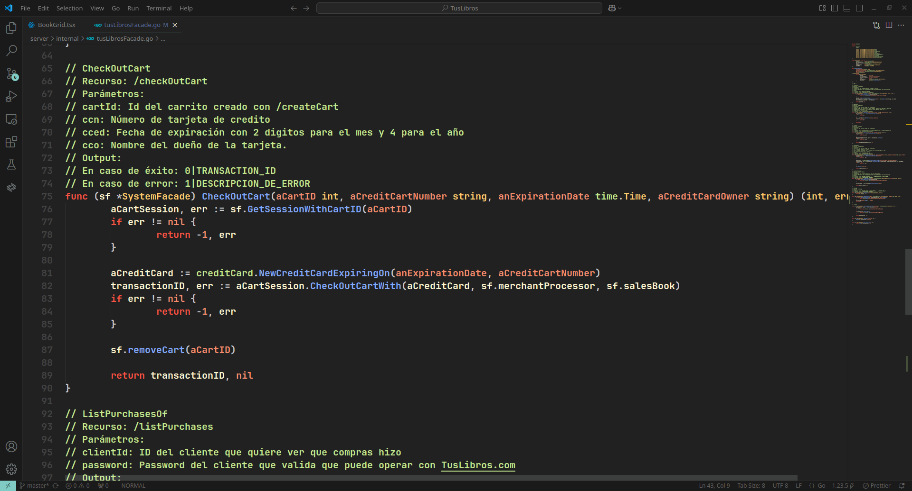
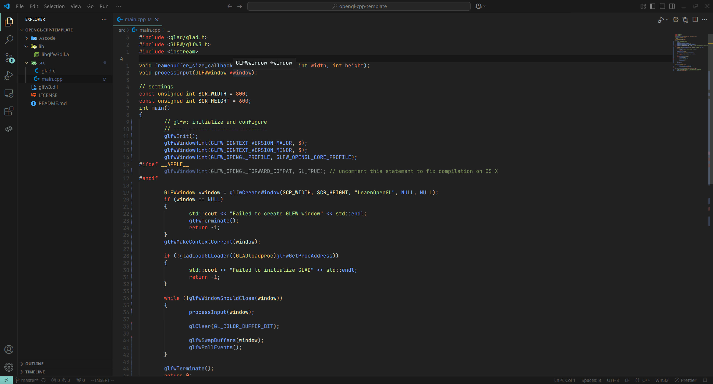
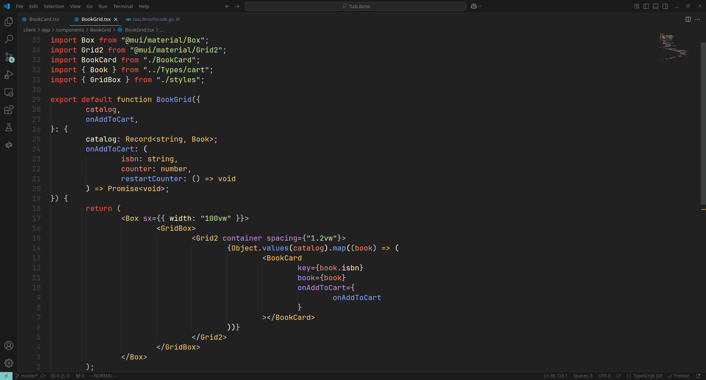

# Lego Dark Theme 🎨

A visually stunning and consistent dark theme for VS Code, inspired by the Material Theme Dark High Contrast and Visual Assist from Visual Studio.

## Features

- High Contrast: Clear and distinct syntax highlighting for better readability.

- Vibrant Colors: Carefully chosen vibrant colors to make your code pop.

- Easy on the Eyes: Designed for long coding sessions without eye strain.

## Showcase

Here are some examples of the Lego Dark Theme in action:

### Go (Golang)

### C++ (OpenGL)

### TypeScript (React)

## Contributing

Contributions are welcome! If you have suggestions, bug reports, or want to contribute to the theme, please follow these steps:

1. Fork the repository.

2. Create a new branch (git checkout -b feature/AmazingFeature).

3. Commit your changes (git commit -m 'Add some AmazingFeature').

4. Push to the branch (git push origin feature/AmazingFeature).

5. Open a Pull Request.

## License

This project is licensed under the MIT License. See the LICENSE file for details.

## Acknowledgments

Inspired by Material Theme Dark High Contrast and Visual Assist.

---

Enjoy coding with Lego Dark Theme! If you love it, consider giving it a ⭐ on the VS Code Marketplace. 😊
